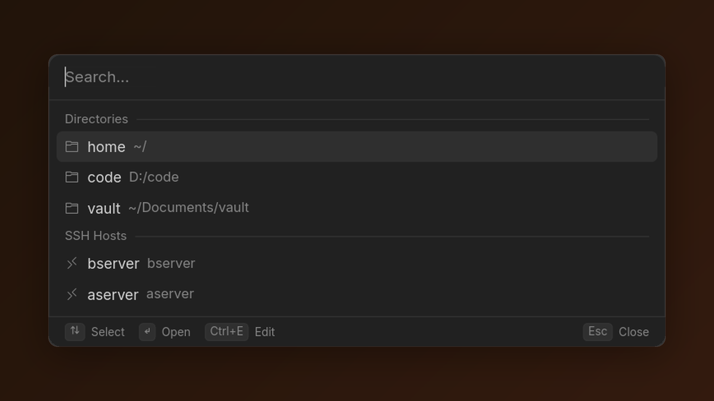

# Terminal Switcher

> The repo is `terminal_launcher`; the crate and binary are `terminal-switcher`. Same project.

A keyboard-driven launcher for terminal sessions. Hit a global hotkey, fuzzy-search your saved directories and SSH hosts, press Enter, and a new [WezTerm](https://wezterm.org/) window opens there.

Built in Rust with [iced](https://iced.rs/). Lives in the system tray. Config is a single TOML file.



## Why

If you hop between the same handful of project directories and remote hosts, opening a terminal and `cd`-ing (or typing `ssh user@...`) every time gets old. This does that one job — closer to Spotlight than to `tmux`.

## Features

- Global hotkey to show and hide (default `Alt+Space`)
- Fuzzy search over names *and* paths/hosts, with matched letters highlighted
- Two entry types: **directory** (runs `wezterm-gui start --cwd <path>`) and **ssh** (runs `wezterm-gui start -- ssh user@host [-p port]`)
- With the search box empty, every entry is listed under **Directories** and **SSH Hosts** headers
- Built-in editor (`Ctrl+E`) to add, edit, and delete entries — no hand-editing TOML
- Tray icon with Config / Restart / Exit
- Colors and font size read from the config file

## Requirements

- [WezTerm](https://wezterm.org/install/windows.html) — `wezterm-gui` must be on your `PATH`
- On Linux: a desktop environment with system tray support (most have one)

To build it yourself you also need [Rust](https://www.rust-lang.org/tools/install) (stable, 2021 edition).

## Install

### Prebuilt binaries

Windows only for now. Grab the archive from the [Releases page](https://github.com/AbstractNucleus/terminal_launcher/releases), unzip it, drop `terminal-switcher.exe` somewhere on your `PATH`, and run it.

macOS and Linux have code paths in the source and should build, but nothing is packaged or tested there yet — build from source and expect rough edges.

### From source

```sh
git clone https://github.com/AbstractNucleus/terminal_launcher.git
cd terminal_launcher
cargo build --release
```

The binary lands at `target/release/terminal-switcher` (`.exe` on Windows). Run `cargo test` for the unit tests.

### Run on startup

- **Windows:** put a shortcut to the binary in `shell:startup` (Win+R, then `shell:startup`).
- **macOS:** add it under System Settings → General → Login Items.
- **Linux:** create a `.desktop` file in `~/.config/autostart/`.

## Usage

1. Launch `terminal-switcher`. On first run it writes a default config with two example entries and opens the editor.
2. Replace the examples with your own directories and SSH hosts, then press `Esc` to reach the launcher.
3. Press `Alt+Space` anywhere. Type a few characters, pick with the arrow keys, press `Enter`.

The launcher hides itself when it loses focus, so clicking elsewhere dismisses it. Pressing the hotkey again while it's open also hides it.

### Keybindings

Launcher:

| Key                                 | Action                                |
| ----------------------------------- | ------------------------------------- |
| `Alt+Space`                         | Show or hide the launcher (configurable) |
| `↑` / `↓`, or `Ctrl+P` / `Ctrl+N`   | Move selection (wraps around)         |
| `Home` / `End`                      | Jump to first / last entry            |
| `Enter`                             | Launch the selected entry             |
| `Ctrl+E`                            | Open the editor                       |
| `Esc`                               | Hide the launcher                     |
| Mouse                               | Hover to select, click to launch      |

Editor:

| Key                 | Action                                              |
| ------------------- | --------------------------------------------------- |
| `Tab` / `Shift+Tab` | Next / previous field                               |
| `Enter`             | Save the entry                                      |
| `Ctrl+N`            | Clear the form to start a new entry                 |
| `Ctrl+E`            | Back to the launcher                                |
| `Esc`               | Cancel — dismisses the delete confirmation first    |

### Config file

Located in the platform's standard config directory:

- **Windows:** `%APPDATA%\terminal-switcher\config.toml`
- **macOS:** `~/Library/Application Support/terminal-switcher/config.toml`
- **Linux:** `~/.config/terminal-switcher/config.toml`

The tray icon's **Config** item opens that folder in your file manager.

```toml
[settings]
# Default palette matches Cursor's near-black greys.
background  = "#141414"
foreground  = "#D4D4D4"
highlight   = "#2F2F2F"
surface     = "#212121"
muted       = "#858585"
accent      = "#D9A05B"   # search matches, selected row, focused field
border      = "#333333"
danger      = "#F14C4C"   # delete confirmation
font_size   = 14          # scales text only; row heights are fixed

[settings.hotkey]
modifier = "Alt"      # Alt | Ctrl | Shift | Super
key      = "Space"    # Space, Enter, Tab, or a-z

[[entry]]
type = "directory"
name = "My Project"
path = "~/projects/myapp"   # ~ expands to your home directory

[[entry]]
type = "ssh"
name = "Prod Box"
host = "user@prod.example.com"
port = 22              # optional
```

Notes:

- The hotkey is one modifier plus one key. Combinations like `Ctrl+Shift+K` aren't supported. An unknown modifier or key falls back to `Alt+Space`.
- Missing color keys fall back to the defaults above. Saving from the editor rewrites the whole file, so gaps get filled in with whatever palette is loaded.
- After editing the file by hand, restart from the tray menu. Hotkey changes only take effect on restart.
- **If `config.toml` fails to parse, the app overwrites it with a fresh default** — a stray quote costs you your entries. Keep a backup before hand-editing.

## Roadmap / non-goals

Deliberately small. It's a launcher, not a terminal, not a session manager, not a replacement for `tmux`. WezTerm is hard-coded; making the terminal configurable is on the table if there's interest.

## License

MIT — see [LICENSE](LICENSE).
</content>
</invoke>
